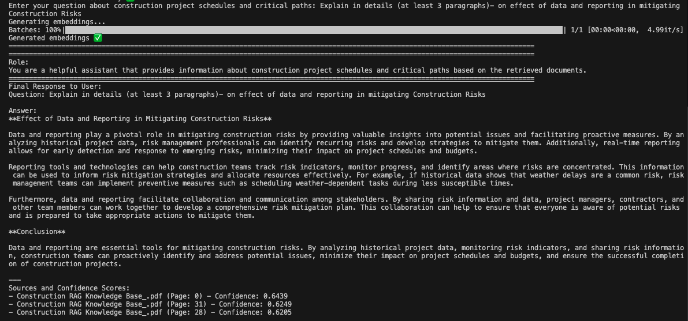
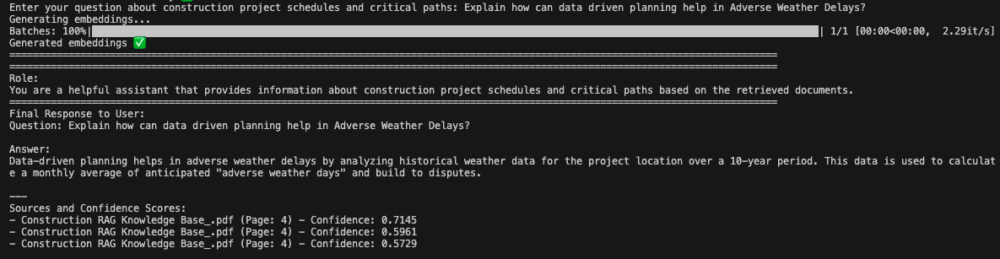
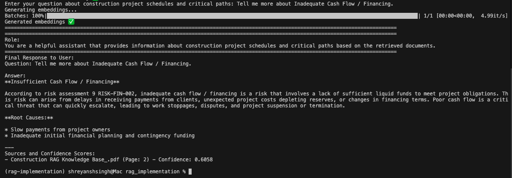
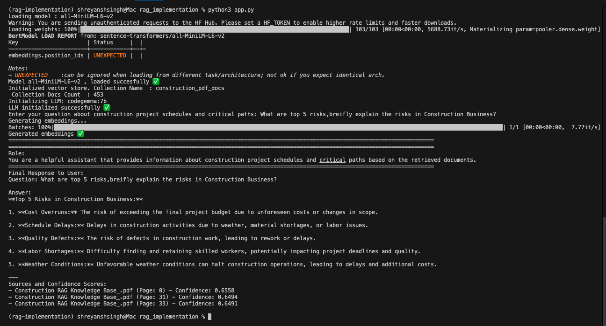

# RAG Implementation - Modular Code Structure

This directory contains a refactored, modular version of the RAG (Retrieval-Augmented Generation) system extracted from `chapter_1.ipynb`.

## Demo - Question & Answering Examples

The RAG system enables intelligent document retrieval and question-answering capabilities. Below are example screenshots showing the system in action:

### Q&A Demonstration









## Project Structure

```
rag_implementation/
├── main.py                      # Entry point and RAGSystem orchestrator
├── src/                         # Source modules
│   ├── __init__.py             # Package initialization
│   ├── config.py               # Configuration settings
│   ├── data_ingestion.py       # Document loading and chunking
│   ├── embedding_manager.py    # Text embedding generation
│   ├── vector_store.py         # ChromaDB vector store management
│   ├── rag_retriever.py        # RAG retrieval logic
│   └── llm_interface.py        # LLM interaction interface
├── notebook/                   # Original Jupyter notebooks
│   └── chapter_1.ipynb         # Original notebook (unmodified)
├── raw_docs/                   # Raw PDF documents
├── data/                       # Data directory
│   └── vector_store/           # ChromaDB persistent storage
├── sample_response_images/     # Q&A demonstration screenshots
└── README.md                   # This file
```

## Modules Overview

### `config.py`
Central configuration file containing:
- Directory paths
- Text chunking settings
- Embedding model configuration
- Vector store settings
- RAG retrieval parameters
- LLM configuration

### `data_ingestion.py`
**Class: `DataIngestionManager`**
- `process_all_pdfs(path)` - Load PDFs from directory with metadata
- `split_documents_in_chunks(documents)` - Split documents into chunks

### `embedding_manager.py`
**Class: `EmbeddingManager`**
- `__init__(model_name)` - Initialize with HuggingFace model
- `generate_embeddings(texts)` - Generate embeddings for text list

### `vector_store.py`
**Class: `VectorStore`**
- `__init__(collection_name, persist_directory)` - Initialize ChromaDB
- `add_documents(documents, embeddings)` - Add docs to vector store
- `reset_collection()` - Reset the collection

**Function: `check_duplicate_documents(vectorstore)`**
- Check and report duplicate documents in vector store

### `rag_retriever.py`
**Class: `RAGRetriever`**
- `retrieve_context(query, top_k, score_threshold)` - Retrieve relevant documents

**Functions:**
- `rag_simple(query, rag_retriever, top_k)` - Basic RAG retrieval
- `rag_advanced(query, rag_retriever, top_k)` - RAG with metadata and confidence scores

### `llm_interface.py`
**Class: `LLMInterface`**
- `__init__(model_name, temperature)` - Initialize LLM
- `generate_response(prompt)` - Generate LLM response

**Functions:**
- `create_rag_prompt(role, question, context, instructions)` - Format RAG prompt
- `format_rag_response(question, response, sources)` - Format response with sources

### `main.py`
**Class: `RAGSystem`**
- Main orchestrator that combines all components
- `__init__()` - Initialize all subsystems
- `ingest_documents(pdf_directory)` - Load and process documents
- `query_simple(query)` - Simple RAG query
- `query_advanced(query)` - Advanced RAG query with metadata
- `answer_question(question)` - Complete Q&A pipeline with LLM

## Usage

### Basic Setup

```python
from main import RAGSystem

# Initialize system
rag_system = RAGSystem()

# Ingest documents
rag_system.ingest_documents("raw_docs/")
```

### Simple Retrieval

```python
# Get context only
context = rag_system.query_simple("What are cost overruns?")
print(context)
```

### Advanced Retrieval

```python
# Get context with metadata
result = rag_system.query_advanced("What are cost overruns?")
print(result["context"])
print(result["sources"])  # Includes source files and confidence scores
```

### Full Q&A Pipeline

```python
# Ask a question and get LLM response with sources
answer = rag_system.answer_question("What are the main risks?", use_advanced=True)
print(answer)
```

### Interactive Mode

```python
# Run from terminal
python main.py
# Then enter questions interactively
```

## Configuration

Edit `src/config.py` to customize:

- **Chunk settings**: `CHUNK_SIZE`, `CHUNK_OVERLAP`
- **Embedding model**: `EMBEDDING_MODEL`
- **Vector store**: `VECTOR_STORE_COLLECTION_NAME`, `VECTOR_STORE_PERSIST_DIR`
- **RAG parameters**: `RAG_TOP_K`, `RAG_SCORE_THRESHOLD`
- **LLM settings**: `LLM_MODEL_NAME`, `LLM_TEMPERATURE`
- **LLM role and instructions**: `LLM_ROLE`, `LLM_INSTRUCTIONS`

## Dependencies

The modular code requires the same dependencies as the original notebook:
- langchain
- langchain-community
- langchain-ollama
- langchain-core
- sentence-transformers
- chromadb
- scikit-learn
- numpy

Install with:
```bash
pip install -r requirements.txt
```

## Differences from Notebook

✅ **Code is now organized into separate modules** for better maintainability
✅ **RAGSystem class** orchestrates all components
✅ **Configuration centralized** in `config.py`
✅ **No notebook cells** - pure Python execution
✅ **Reusable components** - can be imported and used independently
✅ **Better separation of concerns** - each module has single responsibility
✅ **Original notebook preserved** - `chapter_1.ipynb` remains unchanged

## Notes

- The original `chapter_1.ipynb` notebook remains unmodified per requirements
- All functionality from the notebook has been extracted to Python modules
- The modular code can be imported as a package or run as a script
- Each class and function maintains the same interface as the notebook version
- Configuration values match the defaults from the notebook
